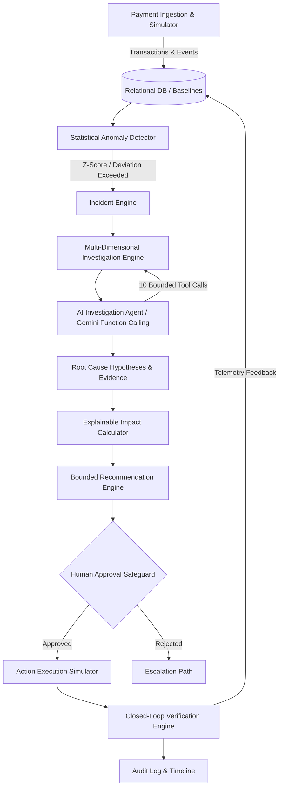

# PayPulse AI — System Architecture

## Architectural Decoupling Principles
1. **Detection Separation**: Pure statistical methods (Z-score, standard error, rolling 7-day baselines, volume guards) trigger incidents. The LLM is **never** the sole authority for anomaly detection.
2. **Deterministic Investigation & Evidence Extraction**: Dimensional aggregations and deviation computations are calculated deterministically by backend services.
3. **Bounded Tool-Calling AI Agent**: The AI agent investigates using strict database tools (`get_incident`, `get_payment_statistics`, `get_failure_breakdown`, `get_historical_baseline`, `get_affected_segments`, `get_recent_events`, `estimate_business_impact`, `get_available_actions`).
4. **Human-in-the-Loop Control**: High-impact recommendations require merchant or operations manager approval before execution.
5. **Closed-Loop Verification**: Measures absolute and percentage success rate recovery before declaring an incident resolved.
